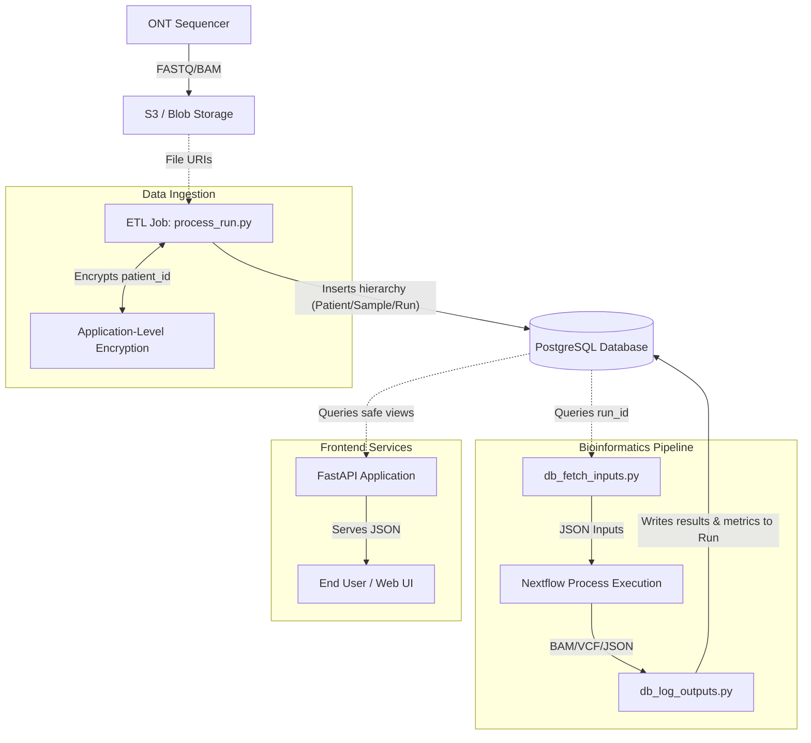
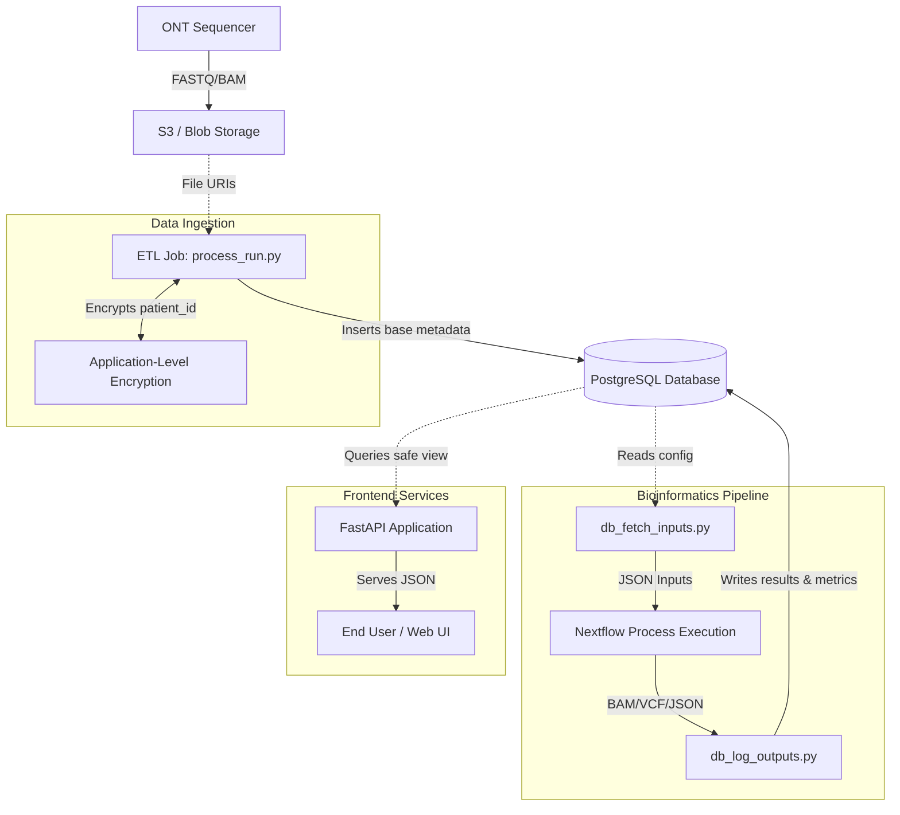

# ngs-variant-validator 🧬

[](#)
[](#)
[](#)

## Overview
`ngs-variant-validator` is an automated, CI/CD-driven testing framework and execution environment for a clinical-grade Oxford Nanopore (ONT) Whole-Genome Sequencing (WGS) pipeline. 

Designed with stringent Software Development Life Cycle (SDLC) best practices, this repository demonstrates how to bridge the gap between biological research and enterprise software engineering. It features a containerized Nextflow architecture, decoupled database I/O via PostgreSQL, a secure REST API, and a dynamic GitHub webhook microservice that maintains a Single Source of Truth (SSOT) between regulatory Google Docs and GitHub Projects Kanban boards.

## 🏗️ System Architecture & Repository Structure

This codebase is strictly modular, separating core bioinformatics logic from cloud infrastructure, data delivery, and project management.

```text
ngs-variant-validator/
├── api/                        # FastAPI backend serving pipeline results (PHI physically blocked)
├── db-init/                    # PostgreSQL schema, RBAC security roles, views, and triggers
├── etl/                        # Data ingestion, DB seeding, and PHI encryption logic
├── pipline-pm-webhook/         # SSOT Webhook: Syncs Google Doc requirements to GitHub Kanban
├── src/ont-clinical-pipeline/  # Core Nextflow DAG and Python I/O middleware
├── tests/                      # Automated test suite (pytest) across API, ETL, and Webhooks
├── utils/                      # Developer QoL scripts (start_dev.sh, stop_dev.sh)
└── .github/workflows/          # CI/CD pipelines enforcing test coverage via Branch Protection
```

### The CI/CD & SSOT Workflow
- **Branch Protection**: The main branch is locked. All Pull Requests automatically spin up a PostgreSQL service container, initialize the schema, and run the pytest suite. Code cannot be merged if tests fail or coverage drops.
- **Regulatory Sync**: When an issue is labeled with a requirement tag (e.g., [REQ-SEC-01]), the Webhook service parses the AST of a master Google Doc, extracts the compliance text, and executes a GraphQL mutation to sync it to the GitHub Kanban board.

## 🔒 Security & Database Architecture

The system uses a highly normalized PostgreSQL backend with strict role-based access control (RBAC):
- **ETL Worker Role (`etl_worker`)**: Has full access to the base `patients`, `samples`, and `runs` tables, including Protected Health Information (PHI) like `patient_id`. Used by the Nextflow pipeline to log results.
- **Frontend API Role (`frontend_api`)**: Can only access the Zero-Trust Views (`frontend_patients`, `frontend_samples`, `frontend_runs`). The patient view projects an MD5 surrogate hash and explicitly excludes the raw `patient_id` ciphertext, ensuring the FastAPI backend physically cannot query or leak PHI, even in the event of an application vulnerability.



## Quick Start
We use automated bootstrapping scripts to ensure local development is frictionless.

### 1. Start the Environment
This script verifies Docker, spins up the PostgreSQL database, waits for it to become healthy, and provisions an optional ngrok tunnel for webhook testing.

```bash
chmod +x utils/start_dev.sh
./utils/start_dev.sh
```

### 2. Run the Test Suite
Ensure your virtual environment is active and dependencies are installed (pip install -r requirements.txt).

```bash
pytest tests/ -v
```

### 3. (Optional) Run the API locally:

```bash
uvicorn api.main:app --reload
```

### 4. Teardown
Safely spin down the containers. Use the --clean flag if you want to wipe the database volume and start fresh tomorrow.

```bash
chmod +x utils/stop_dev.sh
./utils/stop_dev.sh --clean
```

## Front-end API
A lightweight, secure FastAPI microservice designed to serve clinical pipeline results to frontend dashboards.

### Key Features
* **Zero-Trust Security:** Operates under a restricted PostgreSQL role (`frontend_api`) that queries a sanitized database view (`frontend_samples`). It is impossible for this API to leak patient PHI.
* **Scalable Pagination:** Implements strict limits and offset logic, sorting deterministically by timestamp and sample ID to ensure stable UI rendering.
* **High-Speed Metadata Search:** Utilizes PostgreSQL GIN (Generalized Inverted Index) indices to perform fast searches across schema-less JSONB metadata columns.




## Contact
Harrison H. Vaughn Reed | HarrisonHVReed@gmail.com
