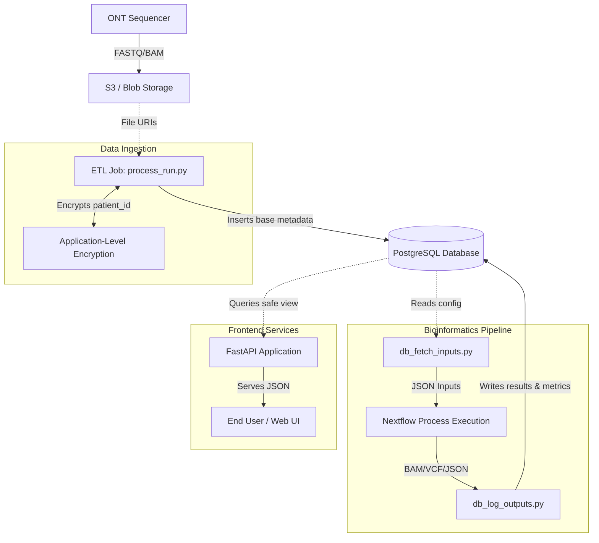

# ngs-variant-validator 🧬

[](#)
[](#)
[](#)

## Overview
`ngs-variant-validator` is an automated, CI/CD-driven testing framework and execution environment for a clinical-grade Oxford Nanopore (ONT) Whole-Genome Sequencing (WGS) pipeline. 

Designed with stringent Software Development Life Cycle (SDLC) best practices, this repository demonstrates how to bridge the gap between biological research and enterprise software engineering. It features a containerized Nextflow architecture, decoupled database I/O via PostgreSQL, a secure REST API, and a dynamic GitHub webhook microservice that maintains a Single Source of Truth (SSOT) between regulatory Google Docs and GitHub Projects Kanban boards.

## 🏗️ System Architecture & Repository Structure

This codebase is strictly modular, separating core bioinformatics logic from cloud infrastructure, data delivery, and project management.

```text
ngs-variant-validator/
├── api/                        # FastAPI backend serving pipeline results (PHI physically blocked)
├── db-init/                    # PostgreSQL schema, RBAC security roles, views, and triggers
├── etl/                        # Data ingestion, DB seeding, and PHI encryption logic
├── pipline-pm-webhook/         # SSOT Webhook: Syncs Google Doc requirements to GitHub Kanban
├── src/ont-clinical-pipeline/  # Core Nextflow DAG and Python I/O middleware
├── tests/                      # Automated test suite (pytest) across API, ETL, and Webhooks
├── utils/                      # Developer QoL scripts (start_dev.sh, stop_dev.sh)
└── .github/workflows/          # CI/CD pipelines enforcing test coverage via Branch Protection
```



## 🔒 Security & Database Architecture

The system uses a PostgreSQL backend with strict role-based access control (RBAC):
- **ETL Worker Role (`etl_worker`)**: Has full access to the base `samples` table, including Protected Health Information (PHI) like `patient_id`. Used by the Nextflow pipeline to log results.
- **Frontend API Role (`frontend_api`)**: Can only access the `frontend_samples` View. The view explicitly excludes the `patient_id` column, ensuring the FastAPI backend physically cannot query or leak PHI, even in the event of a vulnerability. Database triggers automatically manage timestamps.

## Quick Start
1. Install dependencies, create a virtual environment, and spin up the local database:

```bash
python3 -m venv venv
source venv/bin/activate
pip install -r requirements.txt
docker-compose up -d pipeline-db
```

2. Run the automated test suite:

```bash
pytest tests/ -v
```

3. (Optional) Run the API locally:

```bash
fastapi dev api/main.py
```


## Contact

Harrison H. Vaughn Reed  | Bioinformatics Software Engineer | Contact: HarrisonHVReed@gmail.com
