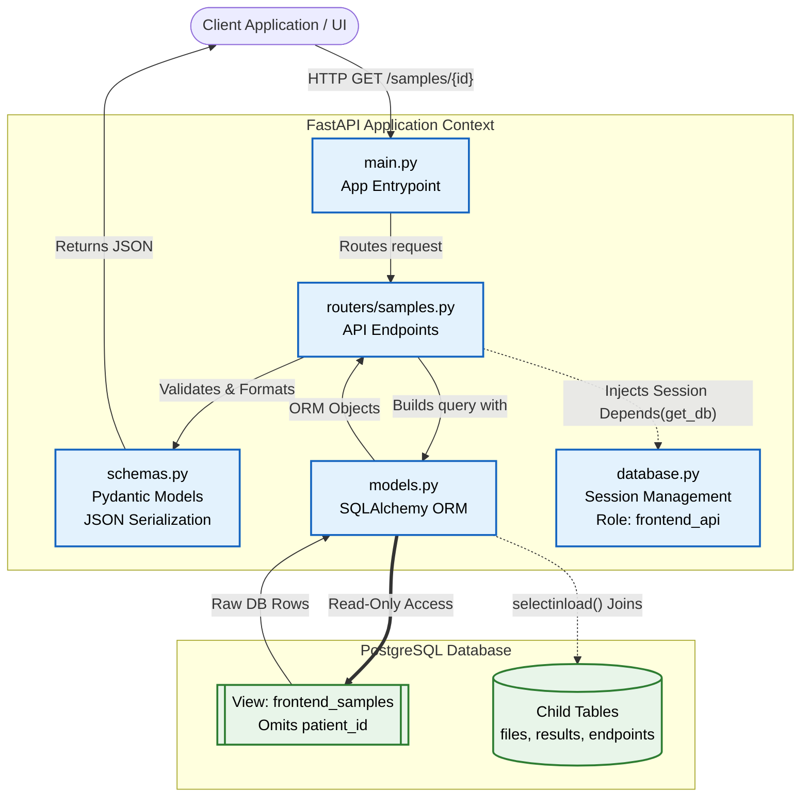

```mermaid
flowchart TD
    Client([Client Application / UI])

    subgraph FastAPI_App [FastAPI Application Context]
        direction TB
        Main[main.py<br>App Entrypoint]
        Router[routers/samples.py<br>API Endpoints]
        Schemas[schemas.py<br>Pydantic Models<br>JSON Serialization]
        Models[models.py<br>SQLAlchemy ORM]
        DB_Conn[database.py<br>Session Management<br>Role: frontend_api]
    end

    subgraph PostgreSQL [PostgreSQL Database]
        View[[View: frontend_samples<br>Omits patient_id]]
        ChildTables[(Child Tables<br>files, results, endpoints)]
    end

    %% Request Flow
    Client -- "HTTP GET /samples/{id}" --> Main
    Main -- "Routes request" --> Router
    Router -. "Injects Session Depends(get_db)" .-> DB_Conn
    
    %% Database Interaction
    Router -- "Builds query with" --> Models
    Models ==> |"Read-Only Access"| View
    Models -.-> |"selectinload() Joins"| ChildTables
    
    %% Response Flow
    View -- "Raw DB Rows" --> Models
    Models -- "ORM Objects" --> Router
    Router -- "Validates & Formats" --> Schemas
    Schemas -- "Returns JSON" --> Client

    %% Styling
    classDef api fill:#e3f2fd,stroke:#1565c0,stroke-width:2px,color:#000;
    classDef safe_db fill:#e8f5e9,stroke:#2e7d32,stroke-width:2px,color:#000;
    
    class Main,Router,Schemas,Models,DB_Conn api;
    class View,ChildTables safe_db;
```
