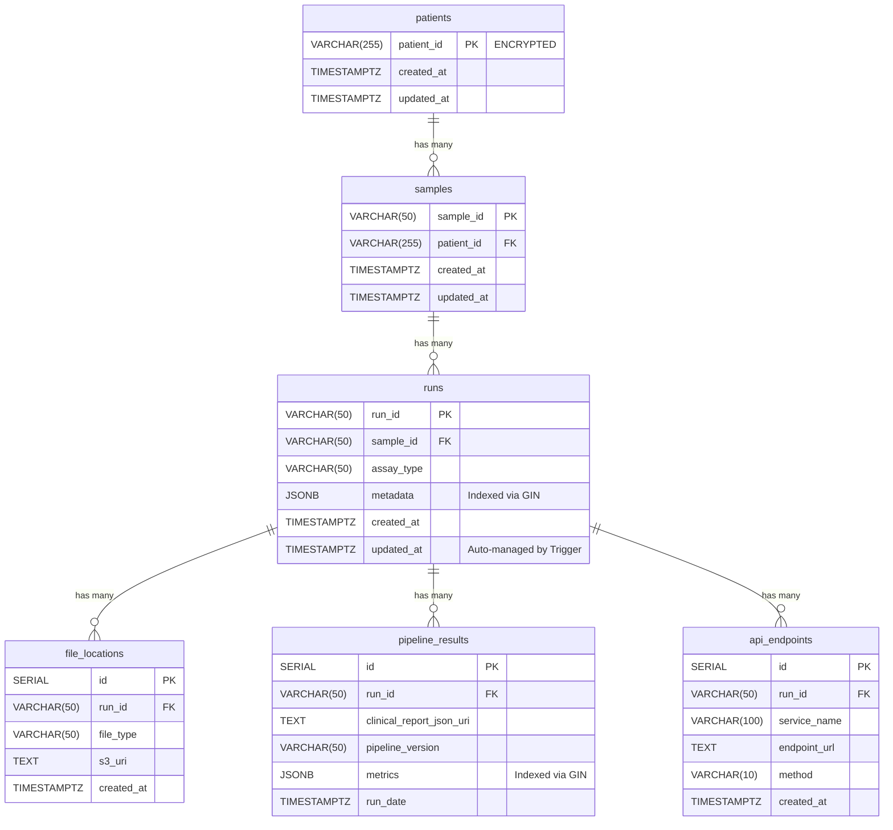

## Database Entity Relationship

```mermaid
erDiagram
    %% Core Hierarchical Tables
    patients {
        VARCHAR(255) patient_id PK "ENCRYPTED"
        TIMESTAMPTZ created_at
        TIMESTAMPTZ updated_at
    }

    samples {
        VARCHAR(50) sample_id PK
        VARCHAR(255) patient_id FK
        TIMESTAMPTZ created_at
        TIMESTAMPTZ updated_at
    }

    runs {
        VARCHAR(50) run_id PK
        VARCHAR(50) sample_id FK
        VARCHAR(50) assay_type
        JSONB metadata "Indexed via GIN"
        TIMESTAMPTZ created_at
        TIMESTAMPTZ updated_at "Auto-managed by Trigger"
    }

    %% Downstream Tables
    file_locations {
        SERIAL id PK
        VARCHAR(50) run_id FK
        VARCHAR(50) file_type
        TEXT s3_uri
        TIMESTAMPTZ created_at
    }

    pipeline_results {
        SERIAL id PK
        VARCHAR(50) run_id FK
        TEXT clinical_report_json_uri
        VARCHAR(50) pipeline_version
        JSONB metrics "Indexed via GIN"
        TIMESTAMPTZ run_date
    }

    api_endpoints {
        SERIAL id PK
        VARCHAR(50) run_id FK
        VARCHAR(100) service_name
        TEXT endpoint_url
        VARCHAR(10) method
        TIMESTAMPTZ created_at
    }

    %% Table Relationships (CASCADE)
    patients ||--o{ samples : "has many"
    samples ||--o{ runs : "has many"
    runs ||--o{ file_locations : "has many"
    runs ||--o{ pipeline_results : "has many"
    runs ||--o{ api_endpoints : "has many"
```