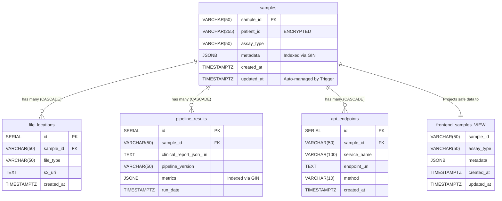

```mermaid
erDiagram
    %% Core Tables
    samples {
        VARCHAR(50) sample_id PK
        VARCHAR(255) patient_id "ENCRYPTED"
        VARCHAR(50) assay_type
        JSONB metadata "Indexed via GIN"
        TIMESTAMPTZ created_at
        TIMESTAMPTZ updated_at "Auto-managed by Trigger"
    }

    file_locations {
        SERIAL id PK
        VARCHAR(50) sample_id FK
        VARCHAR(50) file_type
        TEXT s3_uri
        TIMESTAMPTZ created_at
    }

    pipeline_results {
        SERIAL id PK
        VARCHAR(50) sample_id FK
        TEXT clinical_report_json_uri
        VARCHAR(50) pipeline_version
        JSONB metrics "Indexed via GIN"
        TIMESTAMPTZ run_date
    }

    api_endpoints {
        SERIAL id PK
        VARCHAR(50) sample_id FK
        VARCHAR(100) service_name
        TEXT endpoint_url
        VARCHAR(10) method
        TIMESTAMPTZ created_at
    }

    %% Virtual/Security Layers
    frontend_samples_VIEW {
        VARCHAR(50) sample_id
        VARCHAR(50) assay_type
        JSONB metadata
        TIMESTAMPTZ created_at
        TIMESTAMPTZ updated_at
    }

    %% Table Relationships
    samples ||--o{ file_locations : "has many (CASCADE)"
    samples ||--o{ pipeline_results : "has many (CASCADE)"
    samples ||--o{ api_endpoints : "has many (CASCADE)"

    %% View Projection
    samples ||--|| frontend_samples_VIEW : "Projects safe data to"
```
