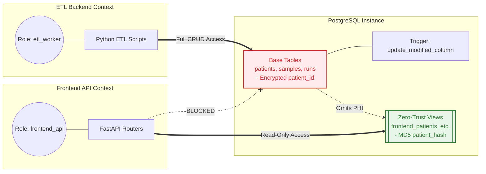

## Database Structure and Responsibilities

```mermaid
flowchart LR
    subgraph ETL [ETL Backend Context]
        Role_ETL((Role: etl_worker))
        Job[Python ETL Scripts]
        Role_ETL --- Job
    end

    subgraph DB [PostgreSQL Instance]
        Base[Base Tables<br>patients, samples, runs<br>- Encrypted patient_id]
        Trigger[Trigger: update_modified_column]
        View[[Zero-Trust Views<br>frontend_patients, etc.<br>- MD5 patient_hash]]
        
        Base --- Trigger
        Base -.-> |Omits PHI| View
    end

    subgraph API [Frontend API Context]
        Role_API((Role: frontend_api))
        FastAPI[FastAPI Routers]
        Role_API --- FastAPI
    end

    %% Connections
    Job ==> |Full CRUD Access| Base
    FastAPI ==> |Read-Only Access| View
    FastAPI -.-x |BLOCKED| Base
    
    classDef secure fill:#ffebee,stroke:#c62828,stroke-width:2px,color:#c62828;
    class Base secure;
    classDef safe fill:#e8f5e9,stroke:#2e7d32,stroke-width:2px,color:#2e7d32;
    class View safe;
```