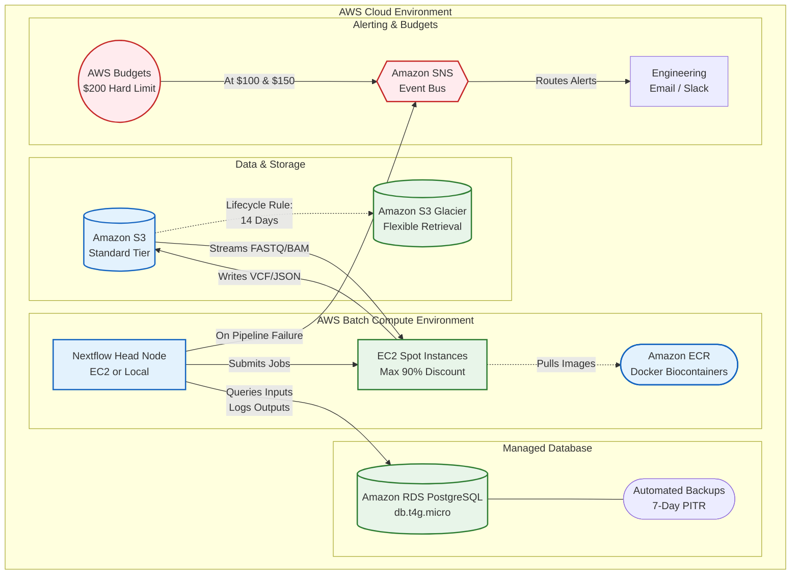

## AWS Cloud Architecture ($200/Month Budget)

```mermaid
flowchart TD
    subgraph AWS_Cloud [AWS Cloud Environment]
        
        subgraph Storage [Data & Storage]
            S3_Hot[(Amazon S3<br>Standard Tier)]
            S3_Cold[(Amazon S3 Glacier<br>Flexible Retrieval)]
            S3_Hot -. "Lifecycle Rule:<br>14 Days" .-> S3_Cold
        end

        subgraph Compute [AWS Batch Compute Environment]
            NF_Head[Nextflow Head Node<br>EC2 or Local]
            Spot[EC2 Spot Instances<br>Max 90% Discount]
            ECR([Amazon ECR<br>Docker Biocontainers])
            
            NF_Head -- "Submits Jobs" --> Spot
            Spot -. "Pulls Images" .-> ECR
        end

        subgraph Database [Managed Database]
            RDS[(Amazon RDS PostgreSQL<br>db.t4g.micro)]
            Backup([Automated Backups<br>7-Day PITR])
            RDS --- Backup
        end

        subgraph Observability [Alerting & Budgets]
            Budgets((AWS Budgets<br>$200 Hard Limit))
            SNS{{Amazon SNS<br>Event Bus}}
            Email[Engineering<br>Email / Slack]
            
            Budgets -- "At $100 & $150" --> SNS
        end
    end

    %% Workflow Connections
    S3_Hot -- "Streams FASTQ/BAM" --> Spot
    Spot -- "Writes VCF/JSON" --> S3_Hot
    
    NF_Head -- "Queries Inputs<br>Logs Outputs" --> RDS
    
    NF_Head -- "On Pipeline Failure" --> SNS
    SNS -- "Routes Alerts" --> Email

    %% Styling to highlight cost-saving/compliance features
    classDef cheap fill:#e8f5e9,stroke:#2e7d32,stroke-width:2px;
    classDef alert fill:#ffebee,stroke:#c62828,stroke-width:2px;
    classDef core fill:#e3f2fd,stroke:#1565c0,stroke-width:2px;
    
    class Spot,S3_Cold,RDS cheap;
    class Budgets,SNS alert;
    class S3_Hot,NF_Head,ECR core;
```
