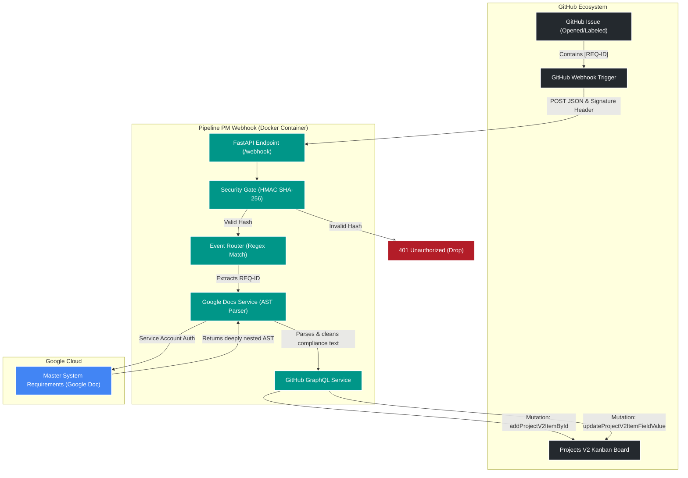

# Project Management Webhooks

A lightweight, cloud-native FastAPI microservice designed to automate project management workflows for bioinformatics pipeline development. This service acts as a secure bridge between a master System Requirements Google Doc and a GitHub Projects V2 Kanban board.

## 🎯 The Goal
To maintain a Single Source of Truth (SSOT). Whenever an issue is opened or labeled with a specific Requirement ID (e.g., `REQ-SEC-01`), this service dynamically traverses the Google Docs Abstract Syntax Tree (AST), extracts the most up-to-date compliance text, and injects it directly into a custom field on the GitHub Project board via GraphQL.

## 🏗️ Architecture

* **Framework:** FastAPI (Python 3.11)
* **Authentication:** HMAC SHA-256 (GitHub Webhooks) & Google Service Accounts
* **Integrations:** * Google Docs API (Read-only AST traversing)
  * GitHub GraphQL API (Projects V2 mutations)
* **Deployment:** Dockerized and managed via GitHub Actions CI/CD




## 🚀 Local Development

This service is fully containerized. To run it locally for development or testing:

### 1. Prerequisites
* Docker installed on your host machine.
* A GitHub Personal Access Token (PAT) with `repo` and `project` scopes.
* A Google Cloud Service Account JSON key (`service_account.json`).

### 2. Environment Variables
Create a `.env` file in the project root (this file is git-ignored):

```env
GITHUB_WEBHOOK_SECRET=your_hmac_secret
GITHUB_PAT=ghp_your_personal_access_token
GOOGLE_DOC_ID=your_google_doc_id
GITHUB_PROJECT_ID=PVT_your_project_id
GITHUB_CUSTOM_FIELD_ID=PVTF_your_field_id
```

### 3. Running the Service
Build and run the Docker container, mounting your Google credentials as a read-only volume:
```bash
docker build -t pipeline-pm-webhook .

docker run --name webhook-service \
  --env-file .env \
  -v $(pwd)/service_account.json:/app/service_account.json:ro \
  -p 8000:8000 \
  pipeline-pm-webhook:latest
```

## 🧪 Testing
The repository utilizes pytest with mocked external API calls to ensure robust CI without hitting rate limits.
```bash
# Run tests locally (requires a virtual environment)
pip install -r requirements.txt pytest httpx
pytest -v tests/
```

## ⚙️ CI/CD Pipeline
Every push to the main branch triggers a GitHub Actions workflow that:

1. Provisions an Ubuntu runner.
2. Executes the pytest suite.
3. If tests pass, builds the Docker image and pushes it to the GitHub Container Registry (GHCR).

<br>
Maintainer: Harrison Reed (harrisonhvreed@gmail.com)
