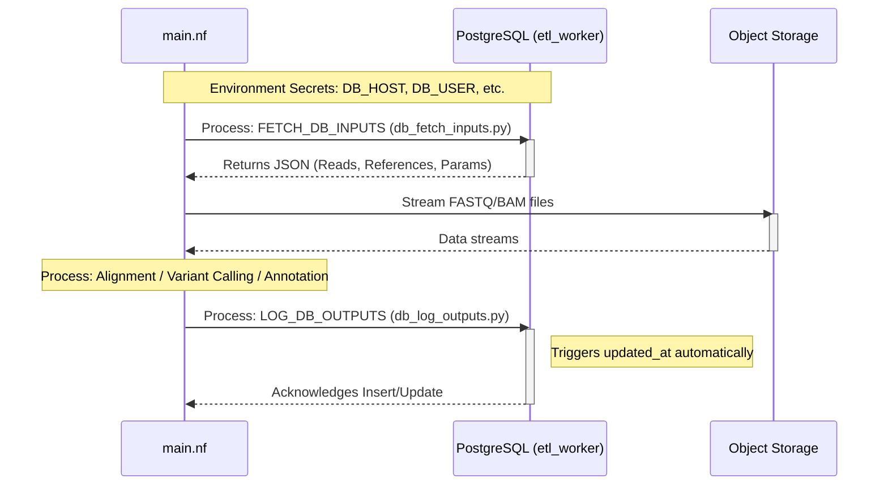

## Nextflow Bioinformatics Pipeline Orchestration

```mermaid
sequenceDiagram
    participant Nextflow as main.nf
    participant DB as PostgreSQL (etl_worker)
    participant S3 as Object Storage

    Note over Nextflow, DB: Environment Secrets: DB_HOST, DB_USER, etc.
    
    Nextflow->>DB: Process: FETCH_DB_INPUTS (db_fetch_inputs.py)
    activate DB
    DB-->>Nextflow: Returns JSON (Reads, References, Params)
    deactivate DB
    
    Nextflow->>S3: Stream FASTQ/BAM files
    activate S3
    S3-->>Nextflow: Data streams
    deactivate S3    

    Note over Nextflow: Process: Alignment / Variant Calling / Annotation
    
    Nextflow->>DB: Process: LOG_DB_OUTPUTS (db_log_outputs.py)
    activate DB
    Note right of DB: Triggers updated_at automatically
    DB-->>Nextflow: Acknowledges Insert/Update
    deactivate DB
```
