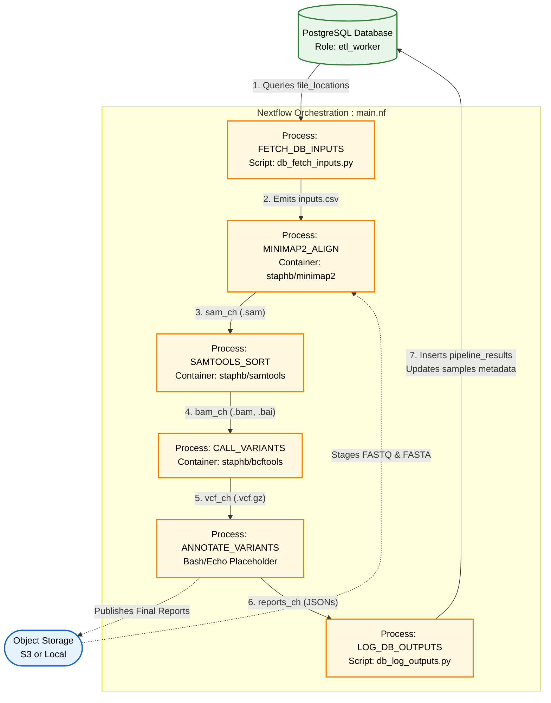

## Nextflow Bioinformatics Pipeline Orchestration

```mermaid
flowchart TD
    %% Define External Entities
    DB[(PostgreSQL Database<br>Role: etl_worker)]
    Storage([Object Storage<br>S3 or Local])

    subgraph Nextflow [Nextflow Orchestration : main.nf]
        direction TB
        
        %% Pipeline Processes
        Fetch[Process: FETCH_DB_INPUTS<br>Script: db_fetch_inputs.py]
        Align[Process: MINIMAP2_ALIGN<br>Container: staphb/minimap2]
        Sort[Process: SAMTOOLS_SORT<br>Container: staphb/samtools]
        Call[Process: CALL_VARIANTS<br>Container: staphb/bcftools]
        Annotate[Process: ANNOTATE_VARIANTS<br>Bash/Echo Placeholder]
        Log[Process: LOG_DB_OUTPUTS<br>Script: db_log_outputs.py]
    end

    %% Step 1: Initialization
    DB -- "1. Queries file_locations" --> Fetch
    Fetch -- "2. Emits inputs.csv" --> Align
    
    %% Step 2: Data Staging
    Storage -. "Stages FASTQ & FASTA" .-> Align

    %% Step 3: The Bioinformatics DAG
    Align -- "3. sam_ch (.sam)" --> Sort
    Sort -- "4. bam_ch (.bam, .bai)" --> Call
    Call -- "5. vcf_ch (.vcf.gz)" --> Annotate
    
    %% Step 4: Output Publishing
    Annotate -. "Publishes Final Reports" .-> Storage
    Annotate -- "6. reports_ch (JSONs)" --> Log

    %% Step 5: Database Finalization
    Log -- "7. Inserts pipeline_results<br>Updates samples metadata" --> DB

    %% Styling
    classDef database fill:#e8f5e9,stroke:#2e7d32,stroke-width:2px,color:#000;
    classDef process fill:#fff8e1,stroke:#f57c00,stroke-width:2px,color:#000;
    classDef storage fill:#e3f2fd,stroke:#1565c0,stroke-width:2px,color:#000;

    class DB database;
    class Storage storage;
    class Fetch,Align,Sort,Call,Annotate,Log process;
```
