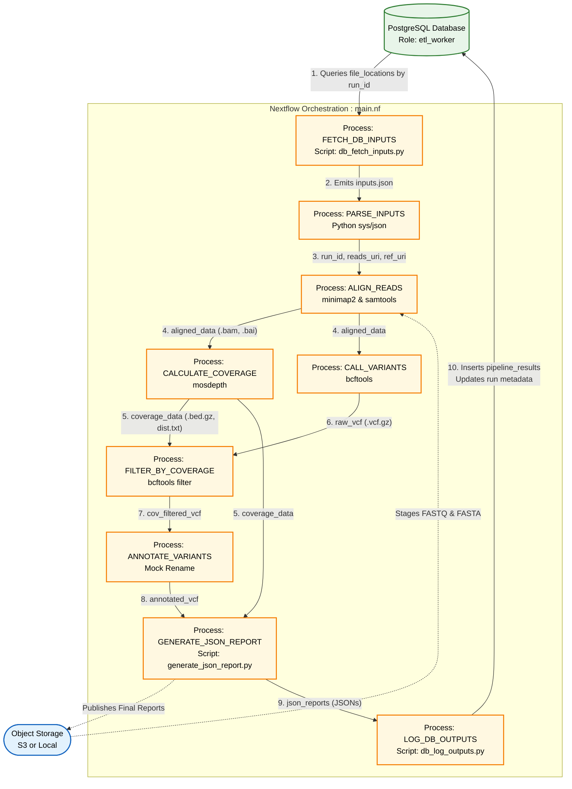

## Nextflow Bioinformatics Pipeline Orchestration

```mermaid
flowchart TD
    %% Define External Entities
    DB[(PostgreSQL Database<br>Role: etl_worker)]
    Storage([Object Storage<br>S3 or Local])

    subgraph Nextflow [Nextflow Orchestration : main.nf]
        direction TB
        
        %% Pipeline Processes
        Fetch[Process: FETCH_DB_INPUTS<br>Script: db_fetch_inputs.py]
        Parse[Process: PARSE_INPUTS<br>Python sys/json]
        Align[Process: ALIGN_READS<br>minimap2 & samtools]
        Cov[Process: CALCULATE_COVERAGE<br>mosdepth]
        Call[Process: CALL_VARIANTS<br>bcftools]
        Filter[Process: FILTER_BY_COVERAGE<br>bcftools filter]
        Annotate[Process: ANNOTATE_VARIANTS<br>Mock Rename]
        Report[Process: GENERATE_JSON_REPORT<br>Script: generate_json_report.py]
        Log[Process: LOG_DB_OUTPUTS<br>Script: db_log_outputs.py]
    end

    %% Step 1: Initialization
    DB -- "1. Queries file_locations by run_id" --> Fetch
    Fetch -- "2. Emits inputs.json" --> Parse
    Parse -- "3. run_id, reads_uri, ref_uri" --> Align
    
    %% Step 2: Data Staging
    Storage -. "Stages FASTQ & FASTA" .-> Align

    %% Step 3: The Bioinformatics DAG
    Align -- "4. aligned_data (.bam, .bai)" --> Cov
    Align -- "4. aligned_data" --> Call
    Cov -- "5. coverage_data (.bed.gz, dist.txt)" --> Filter
    Call -- "6. raw_vcf (.vcf.gz)" --> Filter
    Filter -- "7. cov_filtered_vcf" --> Annotate
    Annotate -- "8. annotated_vcf" --> Report
    Cov -- "5. coverage_data" --> Report
    
    %% Step 4: Output Publishing
    Report -. "Publishes Final Reports" .-> Storage
    Report -- "9. json_reports (JSONs)" --> Log

    %% Step 5: Database Finalization
    Log -- "10. Inserts pipeline_results<br>Updates run metadata" --> DB

    %% Styling
    classDef database fill:#e8f5e9,stroke:#2e7d32,stroke-width:2px,color:#000;
    classDef process fill:#fff8e1,stroke:#f57c00,stroke-width:2px,color:#000;
    classDef storage fill:#e3f2fd,stroke:#1565c0,stroke-width:2px,color:#000;

    class DB database;
    class Storage storage;
    class Fetch,Parse,Align,Cov,Call,Filter,Annotate,Report,Log process;
```